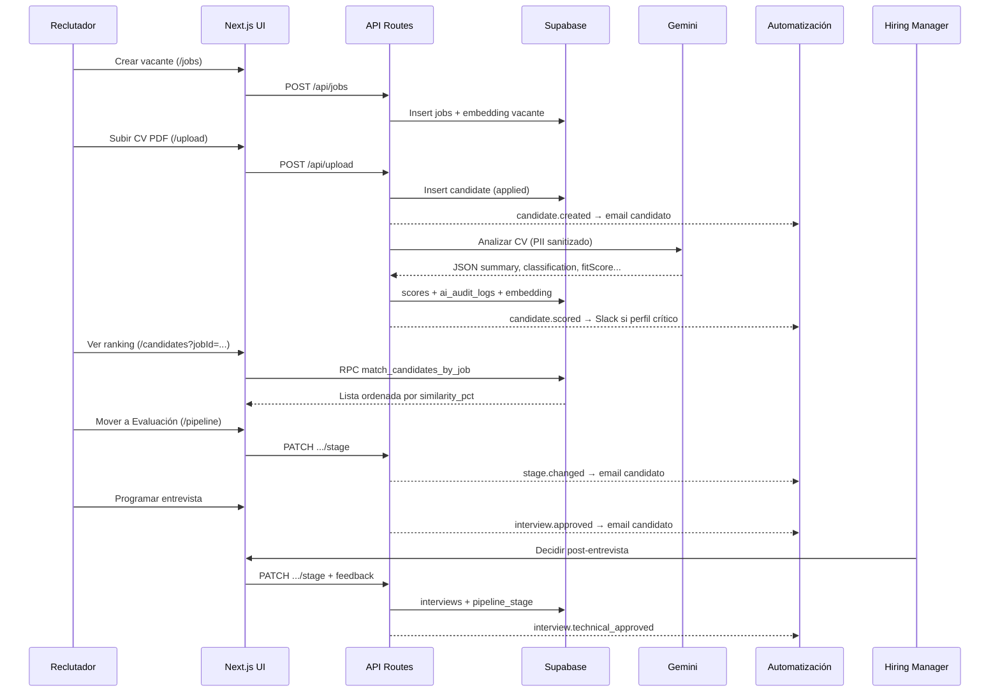

# User Stories — Trazabilidad de Requisitos e Implementación

Documento de referencia para la presentación del proyecto **AI Recruitment Platform** (Venesoft). Relaciona cada historia de usuario y criterio de aceptación del documento de requisitos con la implementación concreta en el sistema, explicando **qué hace el usuario**, **cómo lo resuelve el código** y **dónde verificarlo**.

**Fuente de requisitos:** `AI-Recruitment-requisitos.pdf` (9 de junio de 2026)  
**Repositorio:** `ai-recruiment-system`  
**Última revisión:** 11 de junio de 2026

---

## Índice

1. [Objetivo del sistema](#1-objetivo-del-sistema)
2. [Roles y permisos](#2-roles-y-permisos)
3. [Mapa de user stories](#3-mapa-de-user-stories)
4. [Requisitos de IA y criterios de aceptación](#4-requisitos-de-ia-y-criterios-de-aceptación)
5. [Automatizaciones](#5-automatizaciones)
6. [Flujo end-to-end de referencia](#6-flujo-end-to-end-de-referencia)
7. [Tabla resumen para presentación](#7-tabla-resumen-para-presentación)

---

## 1. Objetivo del sistema

El PDF define la plataforma como un **ATS con capa cognitiva de IA** cuyo valor principal es eliminar la revisión manual e individual de hojas de vida. El sistema combina:

- Gestión operativa de vacantes y pipeline de selección.
- Parseo de CVs en PDF (e imágenes).
- Análisis automático con IA (resumen, seniority, score, riesgo).
- Ranking semántico con embeddings vectoriales (pgvector).
- Automatizaciones de correo y alertas.
- Esquema **human-in-the-loop** para decisiones críticas.

La implementación cumple este objetivo en las rutas `/upload`, `/candidates`, `/pipeline`, `/dashboard` y en las API Routes bajo `app/api/`.

---

## 2. Roles y permisos

| Rol | Código en BD | Qué puede hacer |
|-----|--------------|-----------------|
| **Reclutador** | `recruiter` | Crear vacantes, subir CVs, mover candidatos en el pipeline, ver ranking y métricas. Rol por defecto al registrarse. |
| **Hiring Manager** | `hiring_manager` | Ver candidatos y scores; decidir post-entrevista (aprobar técnica o descartar) con feedback obligatorio. |
| **Administrador** | `admin` | Acceso completo; gestión de vacantes y pipeline sin restricciones adicionales. |

**Implementación:**

- Enum `user_role` en `supabase/migrations/001_initial_schema.sql`.
- Constantes y reglas de permiso en `lib/constants/roles.ts` (`canChangeCandidateStage`, `CRITICAL_STAGES`, `isHiringManager`).
- Row Level Security (RLS) en Supabase para aislar datos por rol autenticado.
- Auth en `app/(auth)/login`, `app/(auth)/register` y `middleware.ts`.

---

## 3. Mapa de user stories

### US-R01 — Reclutador: Subir CVs en formato PDF

| Campo | Detalle |
|-------|---------|
| **Prioridad** | Alta |
| **Necesidad** | Automatizar la lectura e ingesta masiva de perfiles sin fricción. |
| **Estado** | ✅ Implementado |

#### Qué hace el usuario

1. Inicia sesión como reclutador.
2. Va a **Subir CV** (`/upload`).
3. Selecciona la vacante, arrastra o elige un archivo PDF (también JPG/PNG/WebP).
4. Opcionalmente ingresa nombre, email y teléfono del candidato.
5. El sistema registra al candidato y procesa el CV en segundo plano.

#### Cómo lo resuelve el sistema

```
/upload (UI) → POST /api/upload → extractCvText → insert candidates → background:
  ├── Storage Supabase (bucket cvs)
  ├── dispatchAutomation("candidate.created") → email confirmación
  └── processCandidateAi() → Gemini + scores + embedding + audit log
```

| Capa | Archivo | Responsabilidad |
|------|---------|-----------------|
| UI | `components/upload/UploadClient.tsx` | Formulario drag-and-drop, validación de formato (5 MB máx.) |
| Página | `app/(dashboard)/upload/page.tsx` | Carga vacantes abiertas para el selector |
| API | `app/api/upload/route.ts` | Autenticación, rate limit, extracción de texto, insert en BD |
| PDF | `lib/cv/extract-text.ts`, `lib/pdf/parser.ts` | Extracción de texto del PDF |
| OCR | `lib/cv/image-ocr.ts` | CVs en imagen vía Gemini Vision |
| IA | `lib/ai/process-candidate.ts` | Análisis, score, embedding, auditoría |

#### Cómo verificarlo

- Subir un PDF en `/upload` y confirmar que aparece en `/candidates`.
- Revisar en Supabase: tabla `candidates` (con `cv_text`), `scores` y opcionalmente `ai_audit_logs`.
- El candidato recibe correo de confirmación si `RESEND_API_KEY` está configurada.

---

### US-C01 — Candidato: Recibir confirmaciones por correo en cada cambio de etapa

| Campo | Detalle |
|-------|---------|
| **Prioridad** | Alta |
| **Necesidad** | Transparencia y buena experiencia durante el proceso de selección. |
| **Estado** | ✅ Implementado |

#### Qué hace el usuario (candidato)

- No interactúa con el panel interno. Recibe correos automáticos cuando:
  1. Se registra su postulación.
  2. Un reclutador mueve su etapa en el pipeline.
  3. Se programa una entrevista.
  4. Se aprueba la entrevista técnica.

Además puede consultar su estado en la URL pública `/track/[token]` sin login.

#### Cómo lo resuelve el sistema

| Evento | Disparador | Handler | Plantilla |
|--------|------------|---------|-----------|
| `candidate.created` | Tras insert en upload | `handleCandidateCreated` | `applicationReceivedTemplate` |
| `stage.changed` | PATCH `/api/candidates/[id]/stage` | `handleStageChanged` | `stageUpdateTemplate` |
| `interview.approved` | Programación de entrevista | `handleInterviewApproved` | `interviewScheduledTemplate` |
| `interview.technical_approved` | Decisión del Hiring Manager | `handleTechnicalApproved` | `technicalApprovedCandidateTemplate` |

**Archivos clave:**

- `lib/automation/handlers.ts` — lógica de cada evento.
- `lib/automation/templates/` — HTML/texto de los correos.
- `lib/automation/email.ts` — envío vía Resend.
- `lib/automation/dispatch.ts` — orquestador (equivalente nativo a las ramas n8n del PDF).
- `app/track/[token]/page.tsx` — seguimiento público alternativo al correo.

#### Cómo verificarlo

- Subir un CV con email real → correo de confirmación.
- Mover candidato de "Postulado" a "Evaluación" en `/pipeline` → correo de cambio de etapa.
- Abrir el enlace de seguimiento generado en el detalle del candidato.

---

### US-R02 — Reclutador: Visualizar ranking de candidatos por adecuación

| Campo | Detalle |
|-------|---------|
| **Prioridad** | Media |
| **Necesidad** | Enfocar el tiempo operativo en los perfiles verdaderamente idóneos. |
| **Estado** | ✅ Implementado |

#### Qué hace el usuario

1. Va a **Candidatos** (`/candidates`).
2. Filtra por vacante.
3. Con la vacante seleccionada, el listado se ordena por **afinidad** (ranking semántico).
4. Los candidatos se agrupan en tiers: Alta afinidad (≥75%), Afinidad media (≥50%), Por evaluar.
5. Cada tarjeta muestra posición `#1`, `#2`, etc. y badge "Top afinidad" al primero.

#### Cómo lo resuelve el sistema

El ranking **no usa conteo de palabras clave**. Usa similitud coseno entre embeddings vectoriales (768 dimensiones) de la vacante y de cada CV:

1. Al crear/actualizar vacante → `lib/ai/process-job.ts` genera embedding de la vacante.
2. Al analizar candidato → `processCandidateAi` genera embedding del CV contextualizado.
3. La función SQL `match_candidates_by_job` (`supabase/migrations/002_match_function.sql`) calcula `similarity_pct = (1 - distancia_coseno) × 100` y ordena resultados.
4. La UI agrupa con `lib/utils/candidate-ranking.ts` (`sortCandidatesByAffinity`, `groupCandidatesByAffinityTier`).
5. `components/candidates/CandidatesClient.tsx` muestra el ranking visual.

**Fallback:** si no hay embeddings, ordena por `fit_score` de la IA.

#### Cómo verificarlo

- Filtrar candidatos por una vacante con varios postulantes.
- Confirmar orden descendente por `% encaje` o `similarity_pct`.
- En Supabase, ejecutar la RPC `match_candidates_by_job` y comparar con la UI.

---

### US-R03 — Reclutador: Ver resumen compacto de perfil

| Campo | Detalle |
|-------|---------|
| **Prioridad** | Media |
| **Necesidad** | Ahorrar tiempo de lectura en hojas de vida extensas o mal estructuradas. |
| **Estado** | ✅ Implementado |

#### Qué hace el usuario

- En el listado (`CandidateCard`): ve las primeras líneas del resumen IA bajo el nombre.
- En el detalle (`/candidates/[id]`): ve la tarjeta **Resumen IA** con el texto completo generado por Gemini.

#### Cómo lo resuelve el sistema

1. Gemini recibe el CV anonimizado + requisitos de la vacante (`lib/ai/prompt.ts`).
2. Responde JSON con la llave `summary` (validada por `lib/constants/ai-schema.ts`).
3. Se persiste en `scores.summary` vía `processCandidateAi`.
4. La UI lee el score en:
   - `components/candidates/CandidateCard.tsx` (line-clamp 2 líneas).
   - `components/candidates/CandidateDetailClient.tsx` (tarjeta "Resumen IA").

#### Cómo verificarlo

- Abrir detalle de un candidato analizado → sección "Resumen IA" con texto en español citando experiencia y hallazgos.

---

### US-R04 — Reclutador: Detectar nivel de seniority técnico

| Campo | Detalle |
|-------|---------|
| **Prioridad** | Media |
| **Necesidad** | Ajustar y enfocar el tipo de entrevista técnica de forma óptima. |
| **Estado** | ✅ Implementado |

#### Qué hace el usuario

- Ve el badge de clasificación (**Junior**, **Mid**, **Senior**, **Lead**) en listado y detalle.
- Ve años de experiencia estimados y skills coincidentes/faltantes para planificar la entrevista.

#### Cómo lo resuelve el sistema

| Elemento | Implementación |
|----------|----------------|
| Prompt de clasificación | `lib/ai/prompt.ts` — criterios explícitos por nivel |
| Validación JSON | `lib/constants/ai-schema.ts` — `classification` enum |
| Persistencia | `scores.classification` + `scores.skills` (JSONB con `experienceYears`, `matched`, `missing`) |
| UI | Badges en `CandidateCard` y `CandidateDetailClient` |

El prompt instruye a la IA a clasificar por **experiencia laboral real**, no por el título de la vacante, evitando confundir semestres universitarios con años profesionales.

#### Cómo verificarlo

- Subir CVs de perfiles distintos (estudiante vs senior) y comparar `classification` y `experienceYears` en el detalle.

---

### US-HM01 — Hiring Manager: Visualizar score comparativo entre candidatos

| Campo | Detalle |
|-------|---------|
| **Prioridad** | Media |
| **Necesidad** | Tomar decisiones de contratación objetivas y basadas en datos. |
| **Estado** | ✅ Implementado |

#### Qué hace el usuario

1. Filtra candidatos por vacante (misma vista que el reclutador).
2. Compara visualmente:
   - `% encaje` (`fit_score`) o `similarity_pct` en cada tarjeta.
   - Ranking `#1`, `#2`, `#3` en modo afinidad.
   - Seniority, riesgo y skills en el detalle.
3. En etapa **Entrevista**, usa `HiringManagerDecisionCard` para aprobar técnica o descartar con calificación 1–5 y notas.

#### Cómo lo resuelve el sistema

- **Comparación horizontal:** `CandidatesClient` + `CandidateCard` muestran score y ranking lado a lado para todos los candidatos de una vacante.
- **Comparación profunda:** `CandidateDetailClient` expone `fit_score`, `risk_level`, `matchedSkills`, `missingSkills`.
- **Decisión estructurada:** `components/candidates/HiringManagerDecisionCard.tsx` + `PATCH /api/candidates/[id]/stage` con `feedback` obligatorio para `hiring_manager`.

#### Cómo verificarlo

- Iniciar sesión con rol `hiring_manager`.
- Filtrar por vacante con 3+ candidatos → comparar scores y ranking.
- Mover un candidato a entrevista (como reclutador) y luego decidir como HM.

---

### US-T01 — Equipo de Talento: Alertas automáticas por perfiles críticos

| Campo | Detalle |
|-------|---------|
| **Prioridad** | Media |
| **Necesidad** | Reaccionar rápido ante talentos excepcionales. |
| **Estado** | ✅ Implementado |

#### Qué hace el usuario (equipo interno)

- Recibe alerta en **Slack** y/o **correo** cuando un candidato califica como perfil crítico tras el análisis IA.

#### Cómo lo resuelve el sistema

Tras `processCandidateAi`, se dispara `dispatchAutomation("candidate.scored", payload)`.

En `lib/automation/handlers.ts`, la función `isCriticalProfile` evalúa:

```typescript
classification === "Senior" || classification === "Lead"
|| fitScore >= 80
|| (riskLevel === "low" && fitScore >= 70)
```

Si es crítico → `sendSlackMessage` + email a `TALENT_TEAM_EMAIL` con plantilla `criticalProfileTemplate`.

#### Cómo verificarlo

- Subir un CV con perfil senior o alto encaje.
- Revisar canal Slack o bandeja de `TALENT_TEAM_EMAIL`.
- Variables: `SLACK_WEBHOOK_URL`, `TALENT_TEAM_EMAIL`, `RESEND_API_KEY`.

---

### US-T02 — Equipo de Talento: Paneles con métricas de avance por vacante

| Campo | Detalle |
|-------|---------|
| **Prioridad** | Baja |
| **Necesidad** | Evaluar cuellos de botella en el embudo de selección. |
| **Estado** | ✅ Implementado |

#### Qué hace el usuario

- En **Dashboard** (`/dashboard`) ve:
  - Vacantes totales y abiertas.
  - Total de candidatos.
  - Vacantes recientes con conteo de postulantes.
  - Vista previa del pipeline por etapa (Postulado → Evaluación → Entrevista → Contratado).
  - Calendario de entrevistas programadas.

#### Cómo lo resuelve el sistema

| Componente | Archivo |
|------------|---------|
| RPC de métricas | `get_dashboard_metrics()` en `supabase/migrations/004_profile_avatars_and_metrics.sql` |
| Fetch servidor | `lib/data/metrics.ts` → `fetchDashboardMetrics()` |
| UI | `components/dashboard/DashboardView.tsx` |
| API alternativa | `app/api/dashboard/metrics/route.ts` |
| Reporte diario | `app/api/cron/daily-report/route.ts` — email periódico al equipo |

La RPC agrega `stageCounts` (candidatos por etapa) y `applicantsPerJob` (volumen por vacante), permitiendo identificar embudos estancados.

#### Cómo verificarlo

- Abrir `/dashboard` con datos de prueba en varias etapas.
- Revisar que los números coinciden con el pipeline en `/pipeline`.

---

## 4. Requisitos de IA y criterios de aceptación

### Formato JSON obligatorio (requisito transversal)

El PDF exige respuesta JSON estricta con llaves: `summary`, `classification`, `suggestions`, `riskLevel`.

**Implementación ampliada** (el sistema añade campos de valor):

| Llave PDF | Llave en código | Dónde se valida |
|-----------|-----------------|-----------------|
| `summary` | `summary` | `lib/constants/ai-schema.ts` |
| `classification` | `classification` | enum Junior/Mid/Senior/Lead |
| `suggestions` | `suggestions` | string |
| `riskLevel` | `riskLevel` | enum low/medium/high |
| — | `fitScore` | 0–100, usado en ranking |
| — | `experienceYears`, `matchedSkills`, `missingSkills` | enriquecimiento del análisis |

- Gemini se configura con `responseMimeType: "application/json"` en `lib/ai/gemini.ts`.
- El parseo y validación Zod están en `lib/ai/parse-response.ts`.

---

### AC 4.1 — Búsqueda semántica (no por palabras clave)

| Criterio | El motor debe ordenar por afinidad contextual (% similitud), no por conteo de keywords. |
|----------|-------------------------------------------------------------------------------------------|
| **Estado** | ✅ Cumplido |

**Implementación:**

- Extensión `pgvector` habilitada en `001_initial_schema.sql`.
- Embeddings 768-dim con `gemini-embedding-001` (`lib/ai/gemini.ts`).
- Índices HNSW en `jobs.embedding` y `candidates.embedding`.
- Función `match_candidates_by_job` ordena por operador `<=>` (distancia coseno).
- Activación en UI: filtro por vacante en `/candidates` con `semantic=true` (por defecto al elegir vacante).

**Evidencia:** `similarity_pct` en resultados de la RPC; botón "Orden por afinidad" en `CandidatesClient`.

---

### AC 4.2 — Middleware de sanitización PII

| Criterio | Ningún dato sensible debe enviarse en el prompt hacia APIs externas de IA. |
|----------|-------------------------------------------------------------------------------|
| **Estado** | ✅ Cumplido |

**Implementación:**

- `lib/ai/pii-sanitizer.ts` enmascara: teléfonos, emails, documentos de identidad, direcciones.
- `analyzeCandidate` en `lib/ai/gemini.ts`:
  1. Sanitiza el CV.
  2. Ejecuta `containsUnsanitizedPii` — si detecta PII residual, lanza `PII_DETECTED_IN_PROMPT` y **bloquea** la llamada.
  3. El prompt usa texto anonimizado (`buildCandidateAnalysisPrompt`).

**Evidencia:** campo `prompt_anonymized` en `ai_audit_logs` sin datos personales legibles.

---

### AC 4.3 — Auditoría IA con identificadores anonimizados

| Criterio | Trazas de IA con confidencialidad: nombres sustituidos por UUIDs internos. |
|----------|-------------------------------------------------------------------------------|
| **Estado** | ✅ Cumplido |

**Implementación:**

- Tabla `ai_audit_logs` (`001_initial_schema.sql`):
  - `candidate_id` (UUID, no nombre).
  - `prompt_anonymized` (texto sin PII).
  - `model_version`, `latency_ms`, `response_json`.
- Inserción en `lib/ai/process-candidate.ts` tras cada análisis.
- RLS: solo usuarios autenticados con permisos pueden leer logs.

---

### Human-in-the-loop (requisito transversal)

| Criterio | Decisiones críticas requieren confirmación manual del reclutador. |
|----------|-------------------------------------------------------------------|
| **Estado** | ✅ Cumplido |

**Implementación:**

- `CRITICAL_STAGES = ["hired", "rejected"]` en `lib/constants/roles.ts`.
- `PATCH /api/candidates/[id]/stage` exige `confirmed: true` para esas etapas; si no, responde 422.
- UI: modales de confirmación en `PipelineClient.tsx` y `CandidateDetailClient.tsx` antes de contratar o descartar.
- El Hiring Manager debe calificar y dejar notas mínimas (10 caracteres) antes de decidir.

---

## 5. Automatizaciones

El PDF describe flujos **n8n**. En la implementación actual, el motor nativo en `lib/automation/` replica esas ramas sin depender de n8n en runtime (el workflow JSON en `n8n/workflows/` queda como referencia/documentación).

| Flujo PDF (n8n) | Equivalente en código | Evento |
|-----------------|----------------------|--------|
| Confirmación de aplicación | `handleCandidateCreated` | `candidate.created` |
| Alerta perfiles críticos (Slack) | `handleCandidateScored` + `isCriticalProfile` | `candidate.scored` |
| Notificación cambio de etapa | `handleStageChanged` | `stage.changed` |
| Invitación a entrevista | `handleInterviewApproved` | `interview.approved` |
| Reporte diario a hiring managers | `app/api/cron/daily-report/route.ts` | Cron Vercel |
| Manejo de errores / reintentos | `lib/ai/retry.ts`, logs en `lib/logger.ts` | Transversal |

**Variables de entorno:** `RESEND_API_KEY`, `TALENT_TEAM_EMAIL`, `SLACK_WEBHOOK_URL`, `CRON_SECRET`.

---

## 6. Flujo end-to-end de referencia

Diagrama del recorrido principal que cubre la mayoría de user stories en una sola demo:



---

## 7. Tabla resumen para presentación

Use esta tabla en la defensa oral o en diapositivas:

| ID | Rol | User Story (resumen) | Prioridad | Implementación principal | Ruta / evidencia |
|----|-----|----------------------|-----------|--------------------------|------------------|
| US-R01 | Reclutador | Subir CVs PDF | Alta | `UploadClient` + `/api/upload` + `extractCvText` | `/upload` |
| US-C01 | Candidato | Emails por cambio de etapa | Alta | `lib/automation/handlers.ts` | Correo + `/track/[token]` |
| US-R02 | Reclutador | Ranking por adecuación | Media | pgvector + `match_candidates_by_job` | `/candidates` (filtro vacante) |
| US-R03 | Reclutador | Resumen compacto de perfil | Media | Gemini → `scores.summary` | `/candidates/[id]` |
| US-R04 | Reclutador | Detectar seniority | Media | Gemini → `scores.classification` | Tarjetas y detalle |
| US-HM01 | Hiring Manager | Score comparativo | Media | Ranking + `fit_score` + `HiringManagerDecisionCard` | `/candidates`, detalle |
| US-T01 | Equipo Talento | Alertas perfiles críticos | Media | `isCriticalProfile` → Slack/email | Logs + Slack |
| US-T02 | Equipo Talento | Métricas por vacante | Baja | `get_dashboard_metrics` RPC | `/dashboard` |
| AC 4.1 | — | Búsqueda semántica | — | pgvector + embeddings | RPC + UI afinidad |
| AC 4.2 | — | Sanitización PII | — | `pii-sanitizer.ts` | Bloqueo pre-Gemini |
| AC 4.3 | — | Auditoría anonimizada | — | `ai_audit_logs` | Supabase |
| — | — | Human-in-the-loop | — | `CRITICAL_STAGES` + modales | `/pipeline`, detalle |

---

## Documentación relacionada

- [ARCHITECTURE.md](./ARCHITECTURE.md) — diagrama técnico y rutas API.
- [GUIA_COMPLETA.md](./GUIA_COMPLETA.md) — manual operativo y variables de entorno.
- [PHASE_TRACKING.md](./PHASE_TRACKING.md) — estado de las 5 fases del plan Venesoft.
- [DEMO_SCRIPT.md](./DEMO_SCRIPT.md) — guion para demostración en vivo.

---

*Proyecto académico — Venesoft © 2026*
